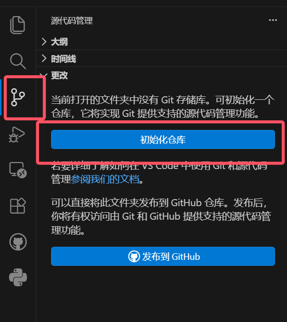
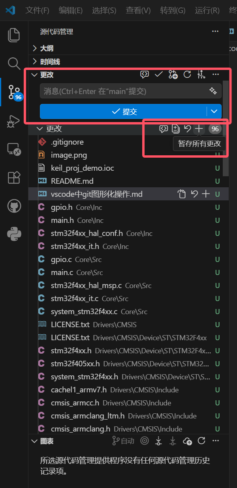
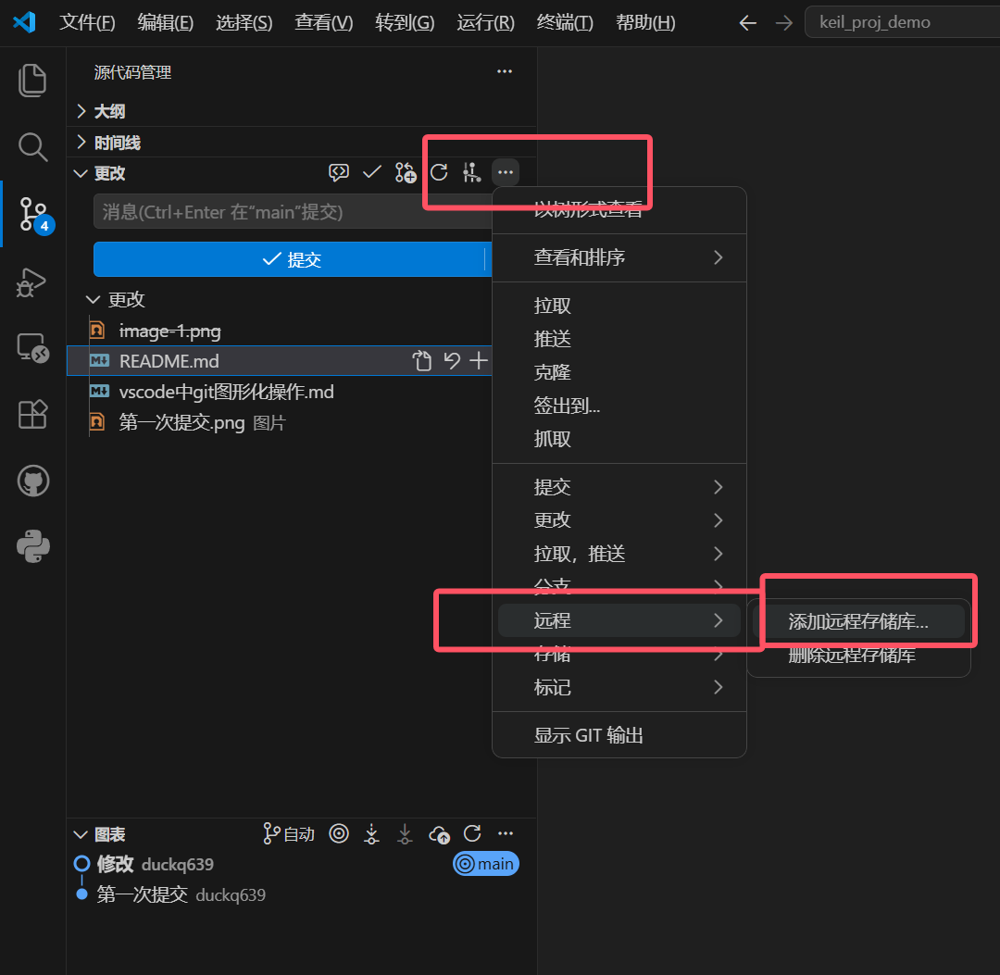
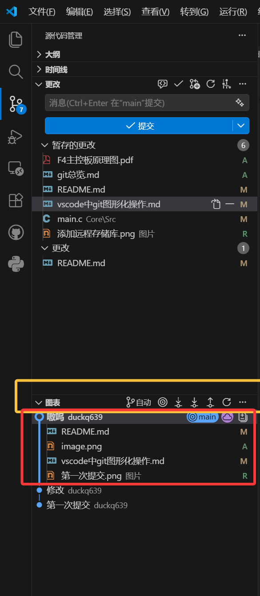

# Git在vscode中的图形化操作方式

## 为什么要用图形化操作

VS Code 的“源代码管理”面板把 Git 的常用操作做成了按钮：暂存、提交、推送、分支切换都可以点一下完成，不用先背命令。

对新手来说，图形化最大的优势是**反馈直观**：改完文件能看到变更标记，提交后能看到新的提交记录，分支合并后 Git 树会直接画出分叉。操作完随时打开 Git 树看一眼，就能确认刚才的动作有没有成功、提交和分支现在长什么样。

## 初始化仓库



## 第一次提交

- 先点击加号暂存所有文件
- 再键入提交信息,点击提交按钮
  

## 关联空远程仓库并首次推送

适用于：本地已经 `git init` 并提交过代码，但远程仓库还是空的，现在想把本地代码推上去。

<small>如果没有创建远程仓库，也可以点击源代码管理面板中的 `Publish Branch` 按钮，VS Code 会帮你创建远程仓库并推送代码。但是教程中不这么做。 </small>

### 1. 先在网页端新建一个空远程仓库

以GitHub平台为例：

- 登录 GitHub，点击右上角头像，再点击Repositories
- 点击右上角 <span style="color: green;">绿色的 `New` </span>来创建一个仓库；
- 新建仓库时只需给仓库命名,其他的保持默认。
- 新建仓库时是**默认不勾选** README、`.gitignore` 等自动生成文件，仓库类型为public；
- 登录 vscode 的 GitHub 插件，不知道如何登录的话, 继续操作,系统会提醒登录。

### 2. 在 VS Code 里添加远程仓库

1. 点击左侧的“源代码管理”图标，或按 `Ctrl+Shift+G`；
2. 点击源代码管理面板右上角的 `...` 菜单；
3. 选择 `远程` -> `添加远程仓库`；
   
4. 输入远程仓库的地址或者名称,选择仓库；
5. 远程仓库名称输入 `origin`，这是 Git 的默认远程仓库名；
6. 点击确认，VS Code 下方状态栏会显示 `origin/main` 等远程分支信息。

### 3. 首次推送到空远程仓库

1. 回到源代码管理面板；
2. 如果 VS Code 显示“发布分支 publish branch”，直接点击它；（这里的“发布分支”是指把本地的 `main` 分支推送到远程仓库）
3. 如果没有显示，点击 `...` 菜单里的 `推送`；
4. 推送完成后，刷新远程仓库页面，就能看到 `main` 分支和工程文件。

### 4. 代码diff

1. 点开如图的 `图表` 按钮，再电机具体的commit记录
2. 在右侧的文件列表中点击某个文件，就能看到该文件的修改内容，红色表示删除，绿色表示新增，蓝色表示修改。

### 5. 之后每次改完代码

图形化流程都是：

```text
暂存（加号） -> 提交（Commit） -> 推送（Push）
```

推送到远程后，队友才能通过 `拉取` 或 `同步` 拿到你的新提交。

### 命令行对照

如果图形化操作不成功，可以使用命令行：

```bash
git remote add origin `你的远程仓库地址`
git push -u origin main
```

`origin` 是远程仓库的别名，`-u` 表示把本地 `main` 分支和远程 `main` 分支建立跟踪关系。以后可以直接执行 `git push`。

### 注意

- 远程仓库必须是空的，否则第一次推送可能提示 `failed to push some refs`；
- 如果远程仓库已经生成了 README，需要先 `git pull --rebase origin main` 合并远程内容，再重新推送；
- 推送失败时先看错误提示，常见原因是远程地址错误、没有权限或没有登录。
