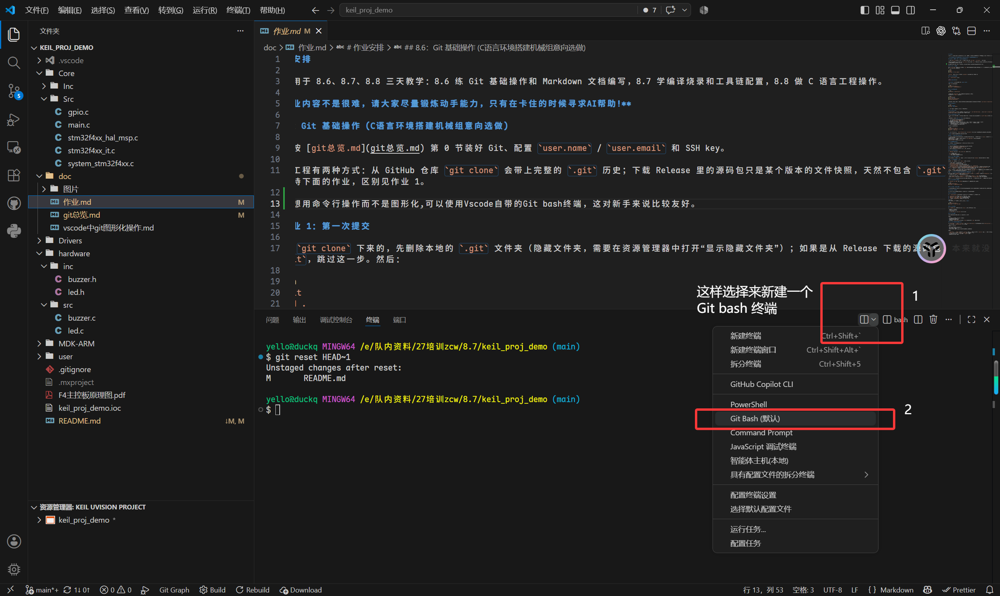
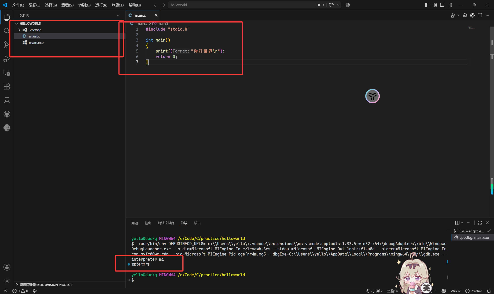
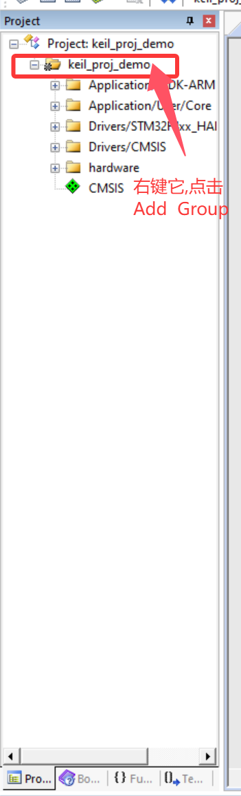
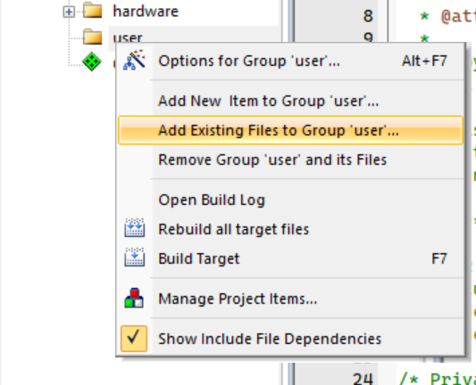
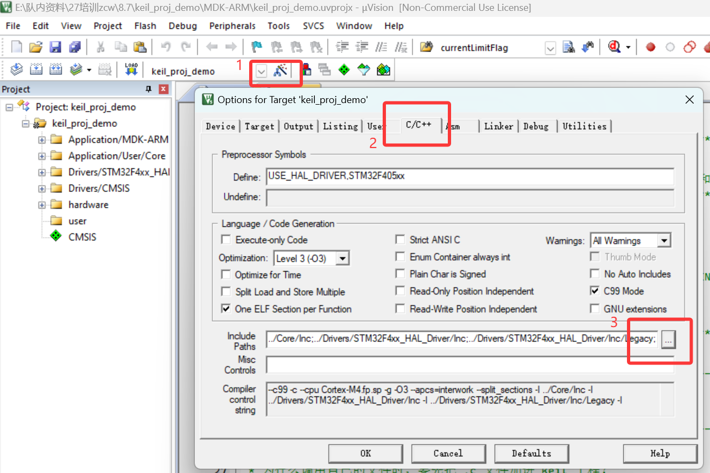
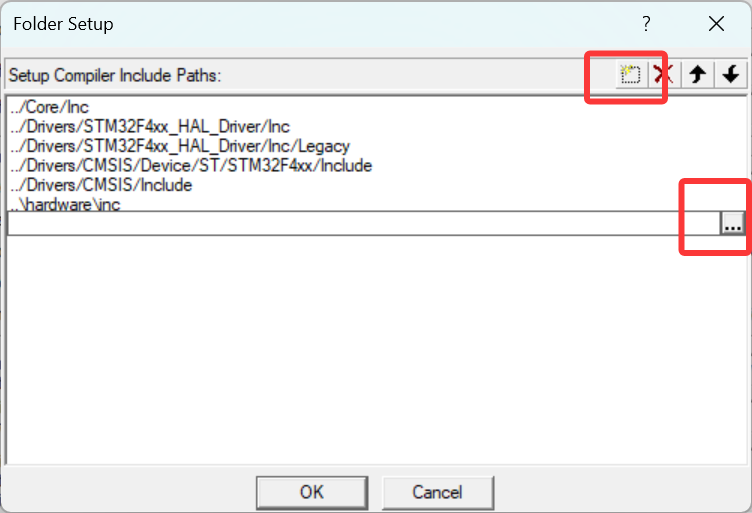

# 作业安排

本工程用于 8.6、8.7、8.8 三天教学：8.6 练 Git 基础操作和 Markdown 文档编写，8.7 学编译烧录和工具链配置，8.8 做 C 语言工程操作。

> **作业内容不是很难，请大家尽量锻炼动手能力，只有在卡住的时候寻求AI帮助!**

## 8.6：Git 基础操作 (C语言环境搭建机械组意向选做)

课前先按 [git总览.md](git总览.md) 第 0 节装好 Git、配置 `user.name` / `user.email` 和 SSH key。

获取本工程有两种方式：从 GitHub 仓库 `git clone` 会带上完整的 `.git` 历史；下载 Release 里的源码包只是某个版本的文件快照，天然不包含 `.git`。两种方式都支持下面的作业，区别见作业 1。

> **首先我建议你在操作时使用Vscode图形化Git操作** [vscode中git图形化操作.md](vscode中git图形化操作.md)

如果你想用命令行操作而不是图形化,可以使用Vscode自带的Git bash终端，这对新手来说比较友好。


### 作业 1：第一次提交

如果是 `git clone` 下来的，先删除本地的 `.git` 文件夹（隐藏文件夹，需要在资源管理器中打开“显示隐藏文件夹”）；如果是从 Release 下载的源码包，本来就没有 `.git`，跳过这一步。然后：

```bash
git init
git add .
git commit -m "first commit"
```

`git add .` 会把当前目录加入暂存区，`.gitignore` 已经排除了 Keil 编译输出。

<small> 如果你在作业流程中出现了难以解决的问题,可以删除Git仓库重新来,虽然实际中不建议这样做</small>

### 作业 2：修改并提交

打开 `Core/Src/main.c`，把：

```c
#define BLINK_TIMES 3U
```

<mark><small> 它在比较上面的位置 </small></mark>

改成 `5U`，保存后提交：

```bash
git add Core/Src/main.c
git commit -m "将闪烁次数调整为5"
```

### 作业 3：分支与合并

```bash
git checkout -b feature-blink
```

在分支里修改 `blink_led()` 的循环次数或延时，提交后切回主分支：
要修改的部分在 `main.c` 的宏定义中

```bash
git checkout main
git log --oneline
git diff main feature-blink
git merge feature-blink
```

注意：如果主分支也改了同一段代码，合并时可能会有冲突，需要手动解决。不想保留分支时用 `git branch -d feature-blink` 删除。

### 作业 4：体验回退

```bash
git log --oneline
git reset --hard HEAD~1
```

回退会丢掉最后一次提交，建议先在练习分支上操作。

### 作业 5：远程仓库

创建个人 GitHub 公开远程仓库, 将代码上传到远程仓库中，练习 `git remote add origin ...`、`git push -u origin main`、`git pull`。操作对照 [vscode中git图形化操作.md](vscode中git图形化操作.md)。

### 作业 6：Markdown 学习记录

把今天练过的 Git 操作写成一份 Markdown 文档，同时练习 Markdown 的常用语法。文件放在 `doc/学习记录.md`，之后 8.7、8.8 的学习记录也往这个文件里继续加。

内容要求（按顺序写，**可以简陋一点**，主要是体会语法）：

1. 一级标题：写上自己的姓名或队名、日期；
2. 二级标题：`## 8.6 Git 基础操作`；
3. 无序列表：今天完成了哪几件事；
4. 有序列表：今天 git 操作的顺序，例如 init -> add -> commit -> branch -> merge -> push；
5. 一个表格：至少 2 条今天用过的 git 命令，包含“命令 / 作用 / 什么时候用”三列；
6. 一个代码块：把你实际执行过的一组命令贴进去；
7. 一个超链接：指向你自己的 GitHub 仓库；

写完后按顺序提交并推送：

```bash
git add doc/学习记录.md
git commit -m "docs: 添加 8.6 学习记录"
git push -u origin main
```

自检：在 VS Code 里打开 `doc/学习记录.md`，按 `Ctrl+Shift+V` 预览，确认标题、列表、表格、代码块都能正常渲染。

> <mark/>今天的作业的提交内容是个人仓库的链接。

### C语言 + Vscode 工具链搭建(选做)

按照控制组软件包的中的步骤完成mingw的和Vscode推荐插件的安装后，新开一个文件夹，新建一个 `main.c` 文件，写一个简单的 `main()` 函数，编译运行，确认能输出“Hello World”。
代码写好以后按 `F5` 编译运行，调试器选项选择 `C/C++:(gdb/LLDB)` ，然后选择推荐项。
文件路径中不要包含中文。


## 8.7：编译烧录与工具链

目标：学会打开工程、编译、下载、复位，并且能自己配置 Keil 工程。

### 作业 1：确认工具链

1. 确认 Keil MDK5、STM32F4 器件支持包、ST-Link 驱动都已安装；
2. 双击打开 `MDK-ARM/keil_proj_demo.uvprojx`；
3. 按 `F7` 编译，确认没有 error；
4. 连接 ST-Link，按 `F8` 下载，复位后观察 LED 和蜂鸣器。

### 作业 2：认识编译产物

在 `MDK-ARM` 目录里找到 `.o`、`.axf`、`.hex` 文件，回答：

- `F7` 完成了哪几步；
- `F8` 把什么文件写进了芯片；
- 为什么改完代码必须重新编译再下载。

### 作业 3：配置工程（重点）

这个作业分两个任务：先把 `user` 组件添加进工程，再把已经在工程里的 `hardware` 文件移除，编译看报什么错。

#### 任务 1：把新组件添加进工程

先完成 `user` 组件的添加，再在 `main.c` 里补上 include：

1. 在 Keil 里新建一个 Group，命名为 `user`；
   
2. 把 `user/src/user_beep.c` 添加进这个 Group；
   
3. 在 `Options for Target -> C/C++ -> Include Paths` 里加上 `..\user\inc`；
   
4. 打开 `Core/Src/main.c`，把 `// 在这里替换成#include user_beep.h` 这行改成 `#include "user_beep.h"`；
5. 按 `F7` 编译，按 `F8` 下载，复位后听蜂鸣器是不是按“长-短-短”响三次。

`main.c` 里已经用 `__weak` 放了空实现占位，并且已经调用了 `user_beep();`，所以不需要自己加调用，只需要补 include。没加 `user/src/user_beep.c` 时用的是占位实现，编译不会报错，只是没有声音。

#### 任务 2：移除已经在工程里的 hardware 文件，编译看报错

工程里已经配置了 `hardware` 组件：`hardware/src/buzzer.c`、`led.c` 在 `hardware` Group 里，`hardware/inc` 在 Include Paths 里。现在分别把它们移除，每移一项都按 `F7` 编译，记下报错再恢复：

- 移除 Include Paths 里的 `..\hardware\inc`：编译报找不到 `buzzer.h` / `led.h` 之类的头文件错误；
- 移除 `hardware` Group 里的 `buzzer.c` 和 `led.c`：链接时报 `Undefined symbol`，因为函数实现没了。

对比任务 1 和任务 2 可以理解：Include Paths 负责让编译器找到 `.h` 头文件，Group 里的 `.c` 负责提供函数实现，两者缺一不可。

### 作业 4：修改现象验证闭环

把 `DELAY_MS` 从 `250U` 改成 `500U`，重新编译下载，观察速度变化，并单独提交：

```bash
git add Core/Src/main.c
git commit -m "change delay to 500"
```

### 作业 5：写一份工具链记录

使用markdown记录自己配置 Keil 工程的完整步骤、遇到的报错和解决办法。可以不交截图，但要把关键配置和报错写清楚。

## 8.8：C 语言工程操作

目标：在真实工程里改变量、函数、循环和判断，做完一个小功能并提交。

### 作业 1：修改现象

打开 `Core/Src/main.c`，依次做下面 4 个修改，每改一个都编译下载观察，并提交一次：

1. `current_led = 1U` 改成 `2U`，观察从哪颗 LED 开始；
2. `BEEP_MS` 从 `120U` 改成 `300U`，观察蜂鸣器响声长短；
3. `delay_ms -= 20U` 改成 `+= 20U`，看速度变化方向；
4. 删掉或改掉 `beep(BEEP_MS)` 的调用，观察程序行为。

提交示例：
<small>(可以使用图形化操作，也可以使用命令行)</small>

```bash
git add Core/Src/main.c
git commit -m "start from led2"
```

### 作业 2：读代码

对照 [README.md](../README.md)，说明 `main.c` 里这些内容分别对应什么：

- 变量定义和作用范围；
- 函数声明与函数定义；
- 形参和实参；
- `for`、`while`、`if`、`switch` 各用在哪里。

### 作业 3：小功能

LED 按编号闪烁不同次数：LED1 闪 1 次、LED2 闪 2 次……

要求：

- 至少用到一个函数、一个循环、一个判断；
- 改完先编译下载确认现象；
- 提交信息能说明改了什么；
- 会分支的用 `feature-姓名`，做完合并回 `main`；不会的直接在 `main` 提交也可以。

### 作业 4：流水灯报警系统（选做）

把 `blink_led()` 和 `beep()` 从 `main.c` 移到 `user/src`、`user/inc` 目录下的新文件里封装，`alarm_sys_func()` 也放在同一个新文件里；`main()` 的主循环只调用 `alarm_sys_func()` 这一个函数。

系统包含 3 个模式：

- 待机：蜂鸣器不响，流水灯不工作；
- 运行：只运行流水灯；
- 报警：流水灯加速运行，蜂鸣器间隔报警(不要求运行互不干扰)。

要求：

- `blink_led()` 和 `beep()` 的声明放在 `user/inc` 的新 `.h` 文件中，实现放在 `user/src` 的新 `.c` 文件中，并把新文件加入 Keil 工程；
- `main()` 的主循环只保留 `alarm_sys_func()` 调用，函数可以传参；
- 模式切换自己设计，建议用一个模式变量加 `switch` 实现；
- 提交信息能说明改了什么。
